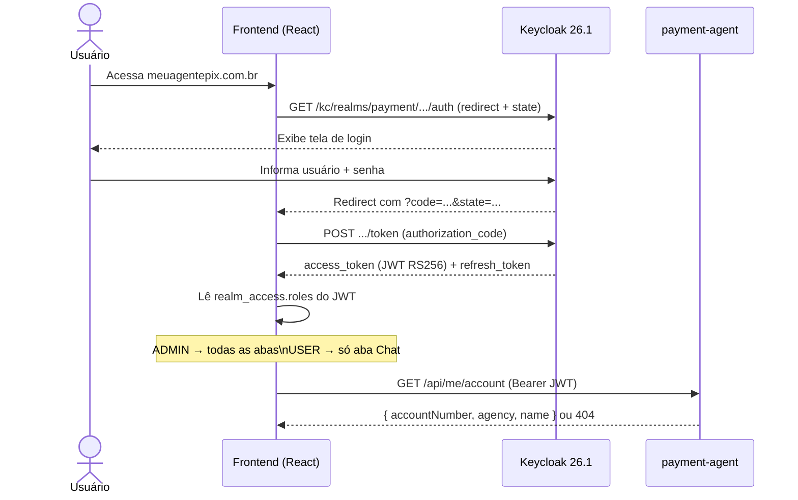
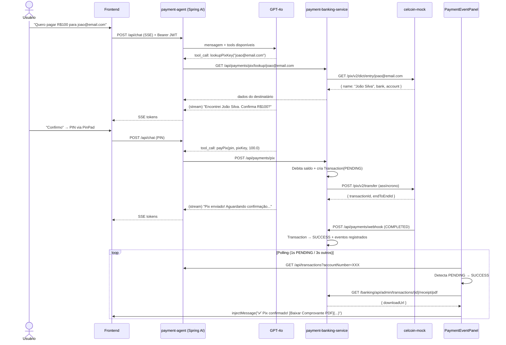
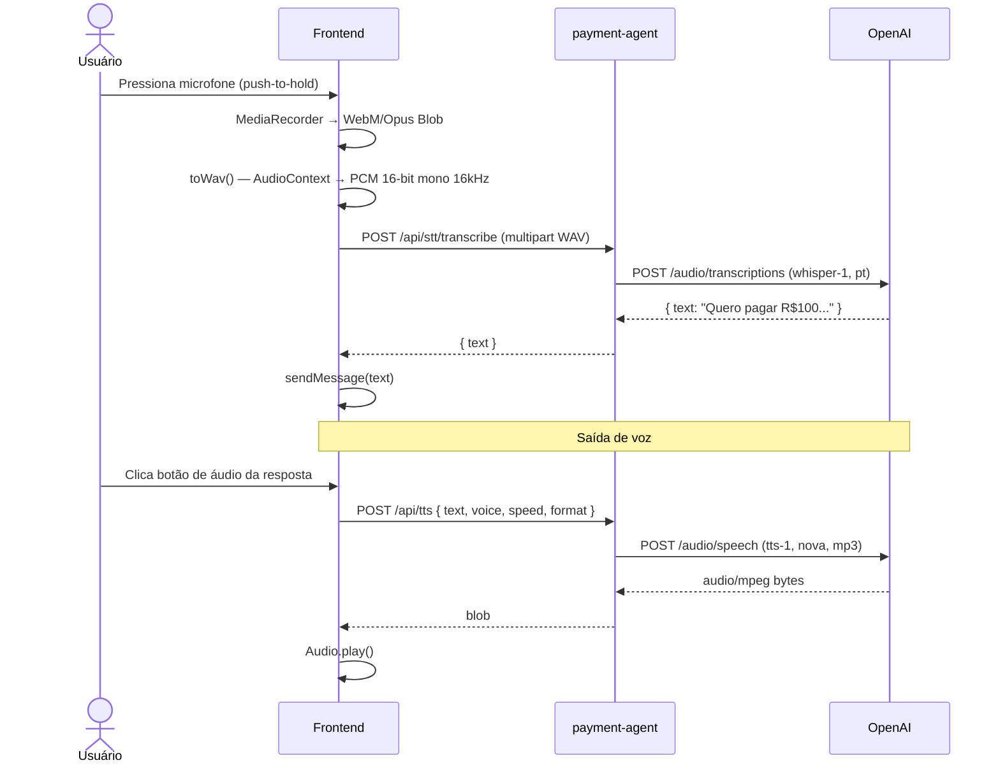
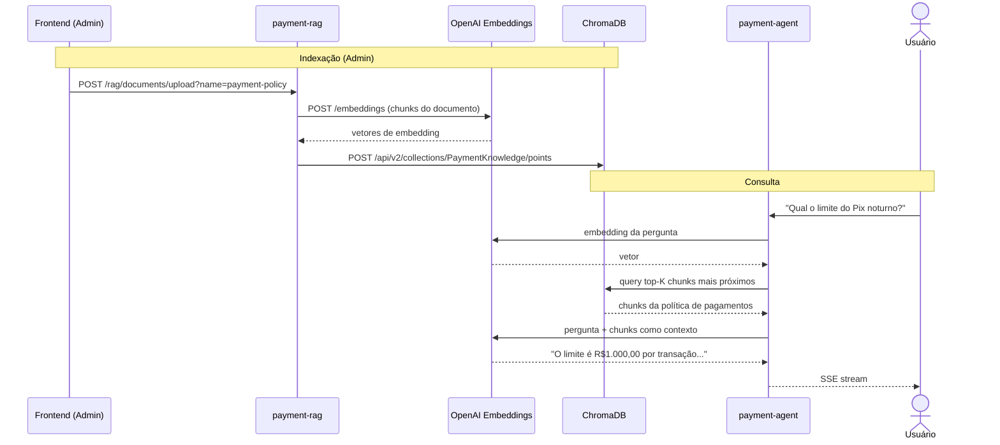
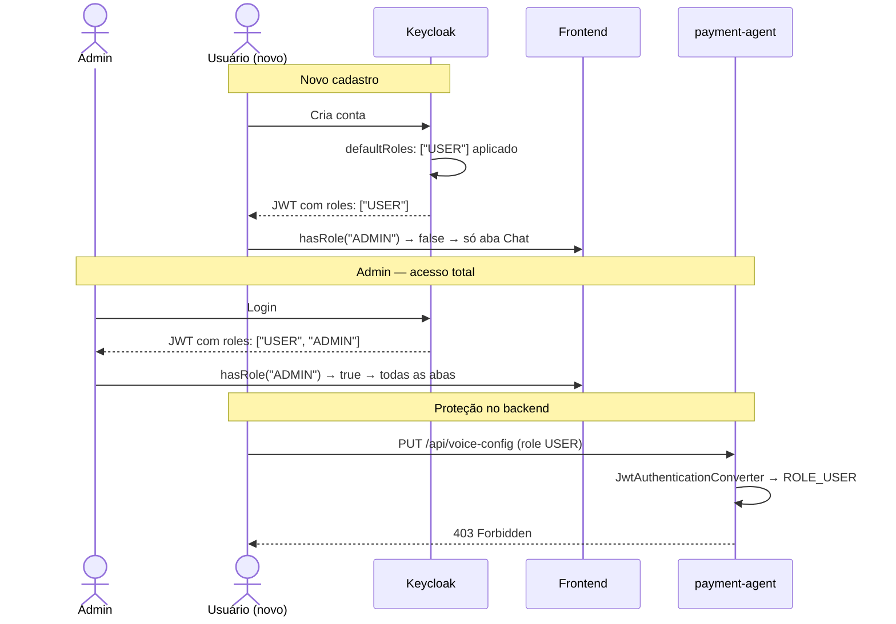

# Payment Agent System

An AI-powered payment assistant built with Spring AI, React, and Keycloak — deployed on Google Cloud Platform.

The system allows users to perform Pix transfers, check balances, and consult a RAG-powered knowledge base through a conversational interface with voice support.

**Live demo:** [meuagentepix.com.br](https://meuagentepix.com.br)

---

## Architecture

```
┌─────────────────────────────────────────────────────────┐
│                     nginx (HTTPS)                        │
│           meuagentepix.com.br — Let's Encrypt            │
└────┬────────────┬──────────────┬────────────┬───────────┘
     │ /api/      │ /kc/         │ /rag/      │ /banking/
     ▼            ▼              ▼            ▼
┌─────────┐  ┌──────────┐  ┌─────────┐  ┌──────────────┐
│ payment │  │ Keycloak │  │ payment │  │   payment    │
│  agent  │  │  26.1    │  │   rag   │  │  banking     │
│ :8080   │  │  :8080   │  │  :8090  │  │  service     │
│Spring AI│  │ OAuth2   │  │ChromaDB │  │   :8081      │
└────┬────┘  └──────────┘  └────┬────┘  └──────┬───────┘
     │                          │               │
     │         OpenAI API       │               │
     │   (GPT-4o + Whisper +    │               │
     │        TTS-1)            │               │
     ▼                          ▼               ▼
┌──────────┐             ┌──────────┐    ┌──────────────┐
│ postgres │             │ ChromaDB │    │celcoin-mock  │
│  (agent) │             │  :8000   │    │  (Pix API)   │
└──────────┘             └──────────┘    └──────────────┘
```

### Services

| Service | Tech | Description |
|---|---|---|
| `payment-frontend` | React + Vite + TypeScript | Chat UI with voice input/output and admin panels |
| `payment-agent` | Spring Boot + Spring AI | AI agent orchestrating tools and OpenAI calls |
| `payment-banking-service` | Spring Boot + JPA | Core banking: accounts, transactions, Pix, statements |
| `payment-rag` | Spring Boot + ChromaDB | RAG pipeline for policy document Q&A |
| `celcoin-mock` | Spring Boot | Celcoin API mock (Pix DICT, transfers, boleto) |
| `keycloak` | Keycloak 26.1 | OAuth2/OIDC identity provider with role-based access |
| `chromadb` | ChromaDB 1.0 | Vector store for RAG embeddings |
| `postgres-*` | PostgreSQL 16 | One database per service (isolated) |

---

## Features

### AI Agent
- Natural language Pix transfers ("Pay R$50 to joao@email.com")
- Balance enquiry and transaction history via chat
- RAG-powered answers from uploaded policy documents
- Voice input (Whisper STT) and voice output (TTS-1)
- Streaming responses via SSE

### Banking
- Account opening linked to Keycloak user (by sub/email)
- Pix transfers with DICT key lookup and end-to-end tracking
- Real-time payment event tracking (DICT_LOOKUP → BALANCE_DEBITED → WEBHOOK_RECEIVED → FINALIZED)
- PDF receipt generation per transaction
- PDF bank statement export

### Security
- JWT authentication on all endpoints (Keycloak RS256)
- Role-based access: ADMIN sees all panels; USER sees Chat only
- Admin-only endpoints enforced at the Spring Security level
- nginx rate limiting (10 req/s API, 5 req/s Keycloak)
- HSTS, X-Frame-Options, X-Content-Type-Options security headers
- CORS restricted to known origins

### Infrastructure
- GCP Compute Engine (e2-medium, southamerica-east1)
- Let's Encrypt TLS via certbot (auto-renewed)
- Cloud Scheduler: VM starts at 08h and stops at 23h on weekdays
- Docker Compose production stack with isolated networks

---

## Project Structure

```
payment-agent-system/
├── payment-frontend/          # React frontend
│   ├── src/
│   │   ├── auth/keycloak.ts   # Lightweight OAuth2 client (no keycloak-js)
│   │   ├── components/        # Chat, Cockpit, RAG, Voice, Transactions panels
│   │   └── api/               # API clients for each backend service
│   ├── nginx.conf             # Dev nginx config
│   ├── nginx.prod.conf        # Production nginx (HTTPS + rate limiting)
│   └── Dockerfile.prod        # Production Docker image
├── payment-agent/             # Spring AI agent
│   └── src/main/java/
│       ├── agent/             # PaymentAssistant (Spring AI ChatClient)
│       ├── tools/             # PaymentTools (@Tool methods called by the LLM)
│       ├── controller/        # Chat, TTS, STT, account endpoints
│       └── config/            # SecurityConfig (JWT + CORS + role mapping)
├── payment-banking-service/   # Core banking
│   └── src/main/java/
│       ├── controller/        # Account, Payment, Cockpit, Webhook controllers
│       ├── service/           # AccountService, PDF generation, event logger
│       └── entity/            # Account, Transaction, TransactionEvent
├── payment-rag/               # RAG service
│   └── src/main/resources/rag/payment-policy.txt
├── celcoin-mock/              # Celcoin API mock
├── keycloak/
│   ├── payment-realm.json     # Dev realm (test users, LAN URIs)
│   └── payment-realm.prod.json # Production realm
├── docker-compose.yml         # Local development stack
├── docker-compose.prod.yml    # Production stack
├── gcp-setup.sh               # GCP infrastructure provisioning
└── deploy.sh                  # VM deploy script
```

---

## Getting Started (Local)

### Prerequisites
- Docker and Docker Compose
- Java 21 (for local builds without Docker)
- Node.js 20+

### 1. Clone and configure

```bash
git clone https://github.com/douglasnogueiram/payment-agent-system.git
cd payment-agent-system

cp .env.prod.example .env
# Edit .env and fill in your OpenAI API key
```

**.env minimum required:**
```env
OPENAI_API_KEY=sk-...
DB_PASSWORD=anypassword
KC_ADMIN_PASSWORD=adminpassword
```

### 2. Start the stack

```bash
docker compose up --build
```

Services will be available at:
| Service | URL |
|---|---|
| Frontend | http://localhost:3000 |
| Keycloak admin | http://localhost:8180/kc/admin |
| payment-agent API | http://localhost:8080 |
| banking-service | http://localhost:8081 |
| payment-rag | http://localhost:8090 |
| pgAdmin | http://localhost:5050 |

### 3. Login

Default test user (created by realm import):
- **Username:** `testuser`
- **Password:** `testpass123`

---

## Production Deployment (GCP)

### 1. Provision infrastructure

```bash
gcloud auth login
bash gcp-setup.sh
```

This creates:
- Static IP (`34.39.140.88`)
- VM `payment-agent-vm` (e2-medium, southamerica-east1-a)
- Firewall rule allowing ports 80 and 443

### 2. Configure DNS

Point your domain A record to the static IP.

### 3. Deploy

```bash
# Copy secrets to VM
scp .env.prod user@<VM_IP>:~/payment-agent-system/.env.prod
scp payment-frontend/.env.production user@<VM_IP>:~/payment-agent-system/payment-frontend/.env.production

# Run deploy script on VM
ssh user@<VM_IP> "cd ~/payment-agent-system && bash deploy.sh"
```

The deploy script handles: Docker install, certbot TLS, image build and service startup.

### 4. Redeploy after changes

```bash
ssh user@<VM_IP> "cd ~/payment-agent-system && ./redeploy.sh"
# Or specific services:
ssh user@<VM_IP> "cd ~/payment-agent-system && ./redeploy.sh payment-frontend payment-agent"
```

---

## Configuration

### Environment variables

| Variable | Description |
|---|---|
| `OPENAI_API_KEY` | OpenAI API key (GPT-4o, Whisper, TTS) |
| `DB_PASSWORD` | Shared PostgreSQL password across all databases |
| `KC_ADMIN_PASSWORD` | Keycloak master realm admin password |

### Voice configuration

Configurable via the UI (ADMIN only):
- Voice model (alloy, echo, fable, onyx, nova, shimmer)
- Speed (0.25–4.0)
- Response format (mp3, opus, aac, flac)

### RAG knowledge base

Upload `.txt` or `.pdf` documents via the "Base de Conhecimento" tab (ADMIN only). Documents are chunked, embedded via OpenAI and stored in ChromaDB.

---

## Role-Based Access

| Role | Access |
|---|---|
| `ADMIN` | All tabs: Chat, Transactions, Cockpit, Knowledge Base, Voice Config, Agent Config |
| `USER` | Chat tab only |

New registrations automatically receive the `USER` role. ADMIN must be assigned manually via Keycloak admin console or `kcadm.sh`.

---

## Sequence Diagrams

### 1. Authentication (OAuth2 Authorization Code)



---

### 2. Pix Payment (end-to-end)



---

### 3. Voice Input/Output (STT + TTS)



---

### 4. RAG Knowledge Base Query



---

### 5. Role-Based Access Control (RBAC)



---

## Tech Stack

**Backend**
- Java 21, Spring Boot 3.3, Spring AI 1.0
- Spring Security (OAuth2 Resource Server, JWT)
- Spring Data JPA, PostgreSQL 16
- OpenAI GPT-4o (chat), Whisper (STT), TTS-1 (voice)
- ChromaDB (vector store)
- iText 7 (PDF generation)

**Frontend**
- React 18, TypeScript, Vite
- Custom OAuth2 client (no keycloak-js dependency)
- SSE streaming for chat responses
- Web Audio API for voice recording and WAV conversion

**Infrastructure**
- GCP Compute Engine (e2-medium)
- Docker Compose
- nginx (reverse proxy, TLS termination)
- Let's Encrypt (certbot)
- Keycloak 26.1 (OpenID Connect)
- Google Cloud Scheduler (VM on/off schedule)

---

## License

MIT
